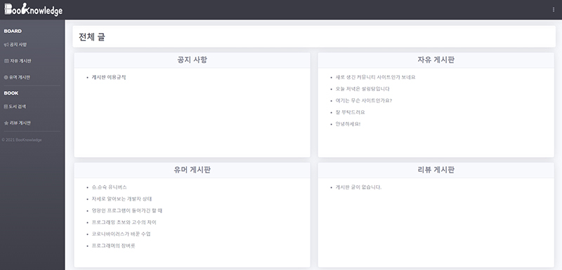

# Community Related To Books
- I created a community site related to books in the form of JSP Model 1.

## Features
- A site that anyone can use.
- A book search function using "[Kakao Api](https://developers.kakao.com/)".
- Apply "[WYSIWYG editor](http://suneditor.com/)" to the text area.

## Preview

## Review
- I thought community sites were as easy to make as they were usually easy to access. However, when I made it from scratch, there was too much work to do. I learned again that there were still too many shortcomings, so I vowed to study harder on the shortcomings.
